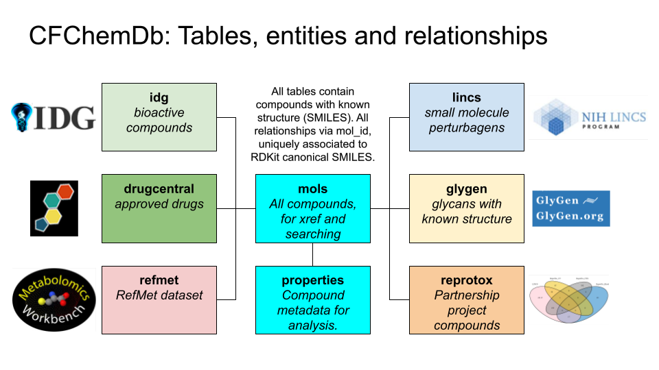
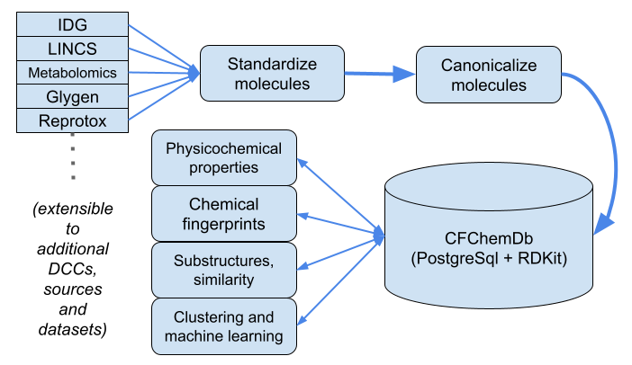

# CFChemDb 

CFChemDb refers to the CFDE Cheminformatics Database and Development System,
designed for chemicals (small molecules) with data from one or multiple
Common Fund projects and datasets.

## Dependencies

* [RDKit](https://www.rdkit.org/)
* [rdkit-tools](https://github.com/jeremyjyang/rdkit-tools)
* [PostgreSql](https://www.postgresql.org/)

## `rdkit-tools` development environment

CFChemDb relies on [RDKit](https://www.rdkit.org/), the RDKit
PostgreSql cartridge, and Python package
[rdkit-tools](https://github.com/jeremyjyang/rdkit-tools),
developed specifically for CFChemDb, for cheminformatics
and machine learning analytics. See
[rdkit-tools](https://github.com/jeremyjyang/rdkit-tools)
documentation for further details.

## CFChemDb Workflow

The CFChemDb can be built with the following workflow.

* [Go\_cfchem\_DbCreate.sh](sh/Go_cfchem_DbCreate.sh)
* [Go\_cfchem\_DbLoad\_IDG.sh](sh/Go_cfchem_DbLoad_IDG.sh)
* [Go\_cfchem\_DbLoad\_LINCS.sh](sh/Go_cfchem_DbLoad_LINCS.sh)
* [Go\_cfchem\_DbLoad\_RefMet.sh](sh/Go_cfchem_DbLoad_RefMet.sh)
* [Go\_cfchem\_DbLoad\_GlyGen.sh](sh/Go_cfchem_DbLoad_GlyGen.sh)
* [Go\_cfchem\_DbLoad\_ReproTox.sh](sh/Go_cfchem_DbLoad_ReproTox.sh)
* [Go\_cfchem\_DbPostprocess.sh](sh/Go_cfchem_DbPostprocess.sh)
* [Go\_cfchem\_DbAddProperties.sh](sh/Go_cfchem_DbAddProperties.sh)
* [Go\_cfchem\_DbAddXrefs.sh](sh/Go_cfchem_DbAddXrefs.sh)

## Cheminformatics methods

See [Cheminfo.md](Cheminfo.md) for details.

## Docker

The database is Dockerized, for flexible deployment and reuse.
Latest version available at: [DockerHub:cfchemdb\_db](https://hub.docker.com/repository/docker/unmtransinfo/cfchemdb_db)

### Docker workflow:

* [Go\_cfchem\_DbDump.sh](sh/Go_cfchem_DbDump.sh)
* [Go\_DockerBuild\_Db.sh](sh/Go_DockerBuild_Db.sh)
* [Go\_DockerClean.sh](sh/Go_DockerClean.sh)
* [Go\_DockerHubPull.sh](sh/Go_DockerHubPull.sh)
* [Go\_DockerHubPullRun.sh](sh/Go_DockerHubPullRun.sh)
* [Go\_DockerHubPush.sh](sh/Go_DockerHubPush.sh)
* [Go\_DockerRun.sh](sh/Go_DockerRun.sh)

## Testing

* [Go\_cfchem\_DbTest.sh](sh/Go_cfchem_DbTest.sh)

## Demo notebook

* [CFChemDb\_Demo.ipynb](notebooks/CFChemDb_Demo.ipynb)

## Cloud hosted instance

A cloud hosted, public instance of CFChemDb is available for low
volume research use, supported by CFDE. Database coordinates and
credentials are available on request. For high volume use, the
Docker container should be deployed locally.
